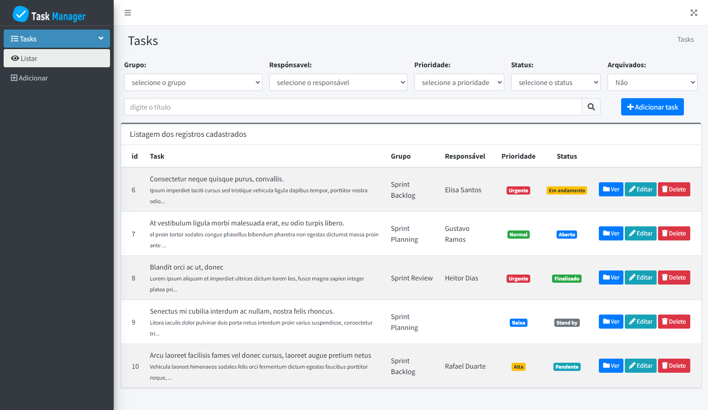
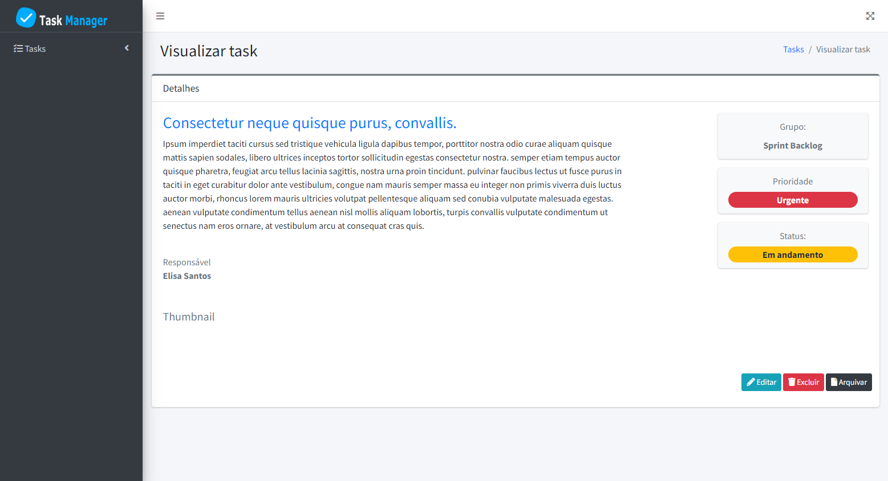
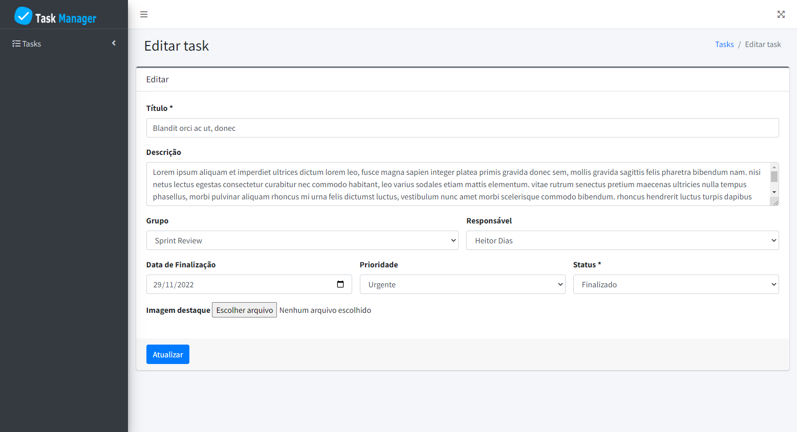

<h2 align="center">
	☑️ Task Manager
</h2>

<p align="center">
 <a href="#-sobre-o-projeto">Sobre</a> •
 <a href="#-layout">Layout</a> • 
 <a href="#-como-executar-o-projeto">Como executar</a> • 
 <a href="#-tecnologias">Tecnologias</a> •  
 <a href="#-autor">Autor</a>
</p>

## 💻 Sobre o projeto

Task manager é ideal para gerenciamento de tarefas visando atingir um objetivo ou meta. Suas principais funcionalidades são: listar as atividades, delegá-las corretamente, priorizá-las e controlar sua execução.

---

## 🎨 Layout

O layout foi elaborado com base o AdminLTE juntamente com o Bootstrap.

<a href="https://adminlte.io/">
  
</a>

<p align="center" style="display: flex; align-items: flex-start; justify-content: center;">
  
</p>
<p align="center" style="display: flex; align-items: flex-start; justify-content: center;">
  
</p>
<p align="center" style="display: flex; align-items: flex-start; justify-content: center;">
  
</p>

<h4 align="center"> 
	✔️ Task Manager ✔️
</h4>

---

## 📌 Como executar o projeto

### Pré-requisitos

Antes de começar, você vai precisar ter instalado em sua máquina as seguintes ferramentas:
[Git](https://git-scm.com), [Laragon](https://laragon.org/) com nginx, mysql e php 8. Além disto é bom ter um editor para trabalhar com o código como [VSCode](https://code.visualstudio.com/)


#### 🧭 Baixando o projeto

```bash
# Clone este repositório
$ git clone git@github.com:danilalucas/task-manager.git
```
#### 🧭 Configurando o projeto

```bash
# Acessar diretório
$ cd task-manager
# Instalar pacotes
$ composer install --dev
# Copiar env
$ cp .env.example .env
# No VSCode acessar .env e configurar conexão do banco
  DB_CONNECTION=mysql
  DB_HOST=127.0.0.1
  DB_PORT=3306
  DB_DATABASE=laravel
  DB_USERNAME=root
  DB_PASSWORD=
# Para rodar o projeto local execute o comando
$ npm run dev
# Acesse o projeto via navegador usando a url disponibilizada pelo laragon
```
---

## 🛠 Tecnologias

As seguintes ferramentas foram usadas na construção do projeto:

-   **[PHP](https://www.php.net/)**
-   **[Laravel](https://laravel.com/)**
-   **[AdminLTE](https://adminlte.io/)**
-   **[Bootstrap](https://getbootstrap.com/)**
-   **[Laragon](https://laragon.org/)**
-   **[MySQL](https://www.mysql.com/)**
-   **[Nginx](https://www.nginx.com/)**

---

## 👩‍💻 Autor

<a href="https://github.com/danilalucas">
 
 <br />
 <sub><b>Daníla Lucas</b></sub></a> <a href="https://github.com/danilalucas" title="Profile"></a>
 <br />

[](https://www.linkedin.com/in/dan%C3%ADla-lucas/) 
[](mailto:danilatemoteolucas@gmail.com)


Feito com ❤️ por Daníla Lucas 👋🏽 [Entre em contato!](https://www.linkedin.com/in/dan%C3%ADla-lucas/)

---